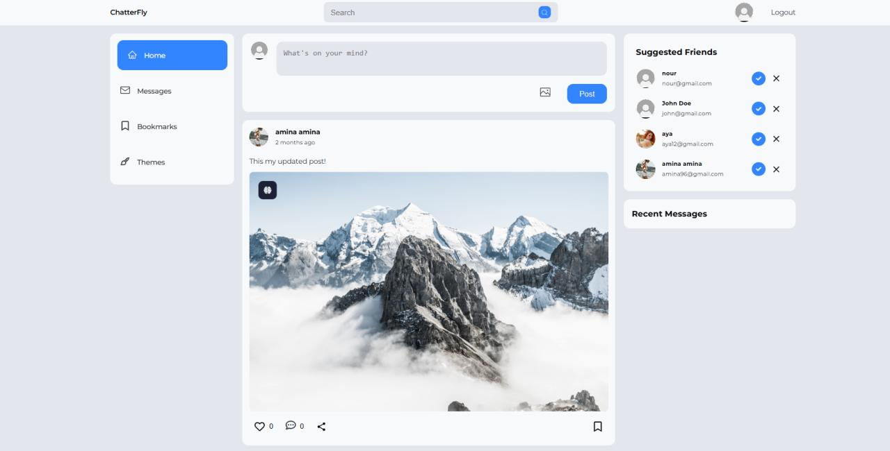

# 🌐 MERN Stack Social Media App with Real-Time Chat

A full-featured **Social Media Application** built with the **MERN Stack**, featuring real-time chat, secure authentication, and a modern, customizable UI. This project demonstrates a production-ready, full CRUD application with complete user authentication, authorization, and real-time communication.


---

## ✨ Features

- 🔐 **Full Authentication & Authorization** — Secure signup/login with JWT
- 👤 **User Profiles** — Create, edit, and manage personal profiles
- 📝 **Full CRUD Posts** — Create, read, update, and delete posts
- 💬 **Real-Time Chat** — Instant messaging powered by Socket.io
- ☁️ **Cloudinary Integration** — Image & file storage for posts and avatars
- 🎨 **Theme Customization** — Light/Dark mode and personalized themes
- ❤️ **Interactions** — Like, comment, and engage with posts
- 👥 **Follow System** — Follow/unfollow other users
- 📱 **Fully Responsive** — Works on desktop, tablet, and mobile
- 🔄 **Redux Toolkit** — App-wide state management for scalability
- 🧪 **API Testing** — Endpoints tested and documented with Postman

---

## 🛠️ Tech Stack

### Frontend
- **React JS** — UI library
- **Redux Toolkit** — State management
- **React Router** — Client-side routing
- **CSS / Material UI / Tailwind** — Styling *(adjust to your setup)*
- **Axios** — HTTP client

### Backend
- **Node.js** — Runtime environment
- **ExpressJS** — Web framework
- **MongoDB** — NoSQL database
- **Mongoose** — ODM for MongoDB
- **Socket.io** — Real-time bidirectional communication
- **JWT** — Authentication & authorization
- **Cloudinary** — Cloud-based file storage
- **bcrypt** — Password hashing

### Tools
- **Postman** — API testing
- **Git & GitHub** — Version control

---

## 🚀 Getting Started

### Prerequisites
Make sure you have the following installed:
- [Node.js](https://nodejs.org/) (v16 or higher)
- [MongoDB](https://www.mongodb.com/) (local or Atlas)
- [Git](https://git-scm.com/)
- A [Cloudinary](https://cloudinary.com/) account

### 1. Clone the repository
```bash
git clone https://github.com/your-username/mern-social-media-chat.git
cd mern-social-media-chat
```

### 2. Install dependencies
```bash
# Backend
cd backend
npm install

# Frontend
cd ../frontend
npm install
```

### 3. Configure environment variables

Create a `.env` file in the **backend** directory:

```env
PORT=5000
MONGO_URI=your_mongodb_connection_string
JWT_SECRET=your_jwt_secret_key
CLOUDINARY_CLOUD_NAME=your_cloud_name
CLOUDINARY_API_KEY=your_api_key
CLOUDINARY_API_SECRET=your_api_secret
CLIENT_URL=http://localhost:3000
```

Create a `.env` file in the **frontend** directory:

```env
REACT_APP_API_URL=http://localhost:5000/api
REACT_APP_SOCKET_URL=http://localhost:5000
```

### 4. Run the application

**Backend:**
```bash
cd backend
npm run dev
```

**Frontend:**
```bash
cd frontend
npm start
```

The app will run at `http://localhost:3000` and the API at `http://localhost:5000`.

---

## 📂 Project Structure

```
mern-social-media-chat/
├── backend/
│   ├── assets/          
│   ├── controllers/     # Route logic
│   ├── middleware/      # Auth & error handling
│   ├── models/          # Mongoose schemas
│   ├── routes/          # API endpoints
│   ├── socket/          # Socket.io setup
|   ├── uploads/
|   ├── utils/
│   ├── .env
│   └── index.js
│
├── frontend/
│   ├── public/
│   ├── src/
│   │   ├── components/  # Reusable UI components
│   │   ├── pages/       # App pages
│   │   ├── helpers/       
│   │   ├── store/    
│   │   ├── utils/       # Helpers
│   │   ├── App.jsx
│   │   ├── main.jsx
│   │   └── index.css
│   ├── .env
│   └── package.json
│
└── README.md
```

---

## 🔌 API Endpoints

### Auth
| Method | Endpoint | Description |
|--------|----------|-------------|
| POST | `/api/auth/register` | Register a new user |
| POST | `/api/auth/login` | Login user & get token |
| POST | `/api/auth/logout` | Logout user |

### Users
| Method | Endpoint | Description |
|--------|----------|-------------|
| GET | `/api/users/:id` | Get user profile |
| PUT | `/api/users/:id` | Update user profile |
| PUT | `/api/users/follow/:id` | Follow / unfollow user |

### Posts
| Method | Endpoint | Description |
|--------|----------|-------------|
| POST | `/api/posts` | Create a new post |
| GET | `/api/posts` | Get all posts |
| GET | `/api/posts/:id` | Get a single post |
| PUT | `/api/posts/:id` | Update a post |
| DELETE | `/api/posts/:id` | Delete a post |
| PUT | `/api/posts/like/:id` | Like / unlike a post |

### Chat
| Method | Endpoint | Description |
|--------|----------|-------------|
| POST | `/api/chat` | Create or access a chat |
| GET | `/api/chat/:userId` | Get user's chats |
| POST | `/api/message` | Send a message |
| GET | `/api/message/:chatId` | Get messages in a chat |

---

## 📸 Preview



---

## 🙏 Credits

- **Tutorial by:** [CodingNepal](https://www.codingnepalweb.com)
- **Stack:** MongoDB, ExpressJS, ReactJS, NodeJS
- **Tools:** Socket.io, JWT, Cloudinary, Redux Toolkit, Postman

---

⭐ If you found this project helpful, please give it a **star**! It means a lot. ⭐
